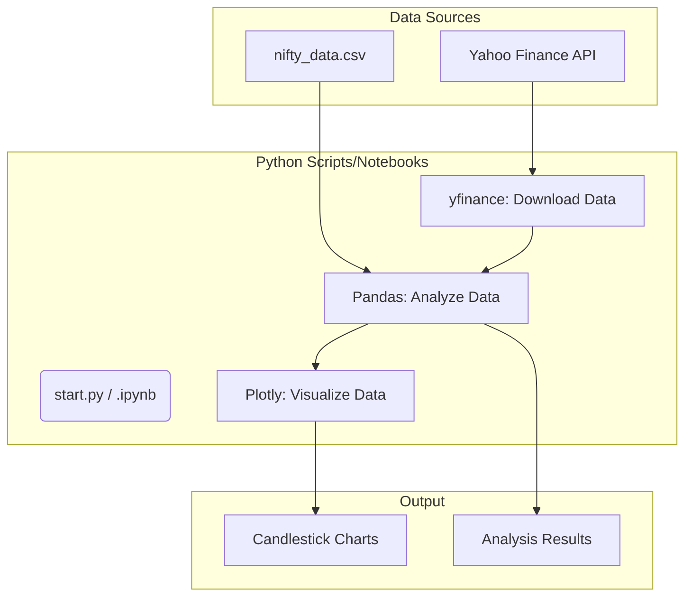

# Financial Data Analysis & Backtesting

## Project Aim
This project explores the analysis of financial market data, serving as a foundation for backtesting algorithmic trading strategies. It includes scripts for fetching, visualizing, and analyzing historical stock and index data.

## Technical Implementation
The project is developed in Python and utilizes several key data science and financial libraries. It uses `yfinance` to download historical market data directly from Yahoo Finance. Data manipulation and analysis are likely performed with `pandas` within the Jupyter Notebooks (`.ipynb`). For visualization, `plotly` is used to create interactive charts, such as candlestick charts, to better understand price action.

## Key Features
- **Data Acquisition:** Scripts to download historical stock data for analysis.
- **Financial Visualization:** Generates candlestick charts to visualize stock performance over time.
- **Jupyter Notebook-Based Analysis:** Contains `.ipynb` files for interactive exploration and development of trading models.

## Setup Instructions
See source code for usage details.

## System Diagram

